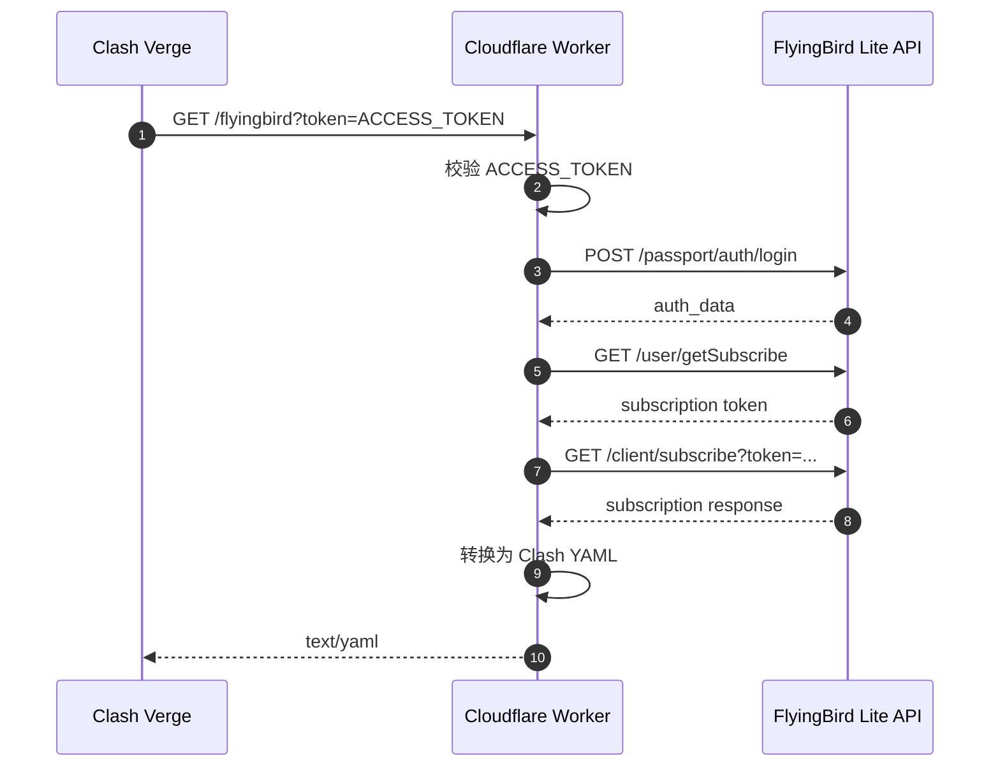

# flying2sub

把 FlyingBird Lite 账号转换为 Clash Verge 可直接订阅的远程链接，由 Cloudflare Worker 在线刷新并返回 Clash YAML。

[](https://developers.cloudflare.com/workers/)
[](#在-clash-verge-中使用)
[](LICENSE)

适合希望把订阅更新交给 Cloudflare Worker 处理、在 Clash Verge 中长期使用同一个订阅 URL 的场景。部署完成后，本地不需要常驻服务，也不需要定期运行脚本。

## 工作原理



## 特性

- **远程订阅**：Clash Verge 按普通远程订阅添加即可。
- **在线刷新**：每次订阅更新都会由 Worker 获取最新上游数据。
- **链接稳定**：更换上游账号时，可以保持 Clash Verge 中的订阅 URL 不变。
- **凭据隔离**：账号邮箱、密码和访问 token 使用 Cloudflare Worker secrets 保存。
- **部署轻量**：项目只包含一个 Worker 入口和 Wrangler 配置。

## 快速开始

### 1. 准备环境

需要先准备：

- 一个 Cloudflare 账号，用于部署 Worker。
- Node.js 18+。
- Wrangler 4+。
- FlyingBird Lite 账号。
- 自定义域名（可选）。没有域名也可以先使用 Cloudflare 默认的 `workers.dev` 地址。

安装 Wrangler：

```bash
npm install -g wrangler
```

登录 Cloudflare：

```bash
wrangler login
```

### 2. 克隆项目

```bash
git clone https://github.com/YuanzAAi/flying2sub.git
cd flying2sub
```

### 3. 生成访问 token

这个 token 用来保护公开订阅地址。本地副本保存在 `access-token.txt`，线上副本保存在 Cloudflare secret。

```bash
openssl rand -base64 32 | tr '+/' '-_' | tr -d '=' > access-token.txt
```

### 4. 写入 Worker secrets

下面命令中的 `FB_EMAIL`、`FB_PASSWORD`、`ACCESS_TOKEN` 是变量名，不需要替换。执行命令后，Wrangler 会提示输入对应的值。

```bash
wrangler secret put FB_EMAIL
wrangler secret put FB_PASSWORD
wrangler secret put ACCESS_TOKEN
```

依次填写：

```text
FB_EMAIL     -> FlyingBird Lite 登录邮箱
FB_PASSWORD  -> FlyingBird Lite 登录密码
ACCESS_TOKEN -> access-token.txt 里的内容
```

### 5. 部署 Worker

```bash
wrangler deploy
```

部署成功后，Wrangler 会输出 Worker 的访问地址。如果配置了自定义域名，也会显示对应域名。

## 配置自定义域名

`wrangler.toml` 中的 `routes` 用来绑定自定义域名：

```toml
routes = [
  { pattern = "sub.example.com", custom_domain = true }
]
```

改成自己的域名后重新部署：

```bash
wrangler deploy
```

如果暂时没有域名，可以保留 `workers_dev = true`，直接使用 Wrangler 输出的 `workers.dev` 地址。

## 在 Clash Verge 中使用

添加远程订阅，URL 填：

```text
https://sub.example.com/flyingbird?token=<ACCESS_TOKEN>
```

当前部署示例：

```text
https://flyingbird.yuangod.cc.cd/flyingbird?token=<ACCESS_TOKEN>
```

默认 `workers.dev` 地址也可使用：

```text
https://flyingbird-sub.yuanzaai.workers.dev/flyingbird?token=<ACCESS_TOKEN>
```


## 配置说明

`wrangler.toml` 中保存非敏感运行配置：

```toml
[vars]
API_BASE = "https://fbesa.apiv2.a047.com/api/v1"
KEY_ASCII = "14f521a32997b257"
IV_ASCII = "d217125f4b9cc9c8"
```

Cloudflare Worker secrets 保存：

```text
FB_EMAIL
FB_PASSWORD
ACCESS_TOKEN
```

查看已配置的 secrets：

```bash
wrangler secret list
```

## 验证部署

健康检查：

```bash
curl https://sub.example.com/health
```

预期返回：

```json
{
  "ok": true,
  "service": "flyingbird-sub"
}
```

订阅检查：

```bash
TOKEN="$(cat access-token.txt)"
curl -L "https://sub.example.com/flyingbird?token=${TOKEN}" | head
```

返回内容应为 `text/yaml`，并包含类似字段：

```yaml
proxies:
proxy-groups:
rules:
```

## 常见问题

**403 `invalid access token`**

URL 中的 token 与 Worker secret `ACCESS_TOKEN` 不一致。重新设置：

```bash
wrangler secret put ACCESS_TOKEN
```

**Worker 返回 502**

通常表示 Worker 没有成功刷新或转换订阅数据。查看日志：

```bash
wrangler tail flyingbird-sub
```

**自定义域名访问失败**

确认 `wrangler.toml` 中的 `routes` 是你要使用的域名，然后重新部署：

```bash
wrangler deploy
```

## 文件结构

```text
.
├── worker.js              # Cloudflare Worker 入口
├── wrangler.toml          # Worker 部署配置
├── README.md
├── docs/
│   └── flyingbird-lite.md # 维护说明
└── access-token.txt       # 本地访问 token，已在 .gitignore 中排除
```

## 凭据管理

- `FB_EMAIL`、`FB_PASSWORD` 和 `ACCESS_TOKEN` 通过 Cloudflare Worker secrets 管理。
- `access-token.txt` 仅用于本地保存订阅访问 token，默认已被 `.gitignore` 排除。
- 订阅链接泄露时，重新设置 `ACCESS_TOKEN` 即可让旧链接失效。
- 建议使用独立子域名部署这个 Worker，避免和已有业务共用根域名。

## License

MIT
